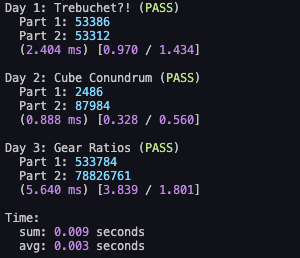

# Advent of Code Solutions
This repository contains (almost) all of my solutions to Advent of Code through the years.

The first year I participated in Advent of code was 2017 but I only got a couple of days back then.
In 2018 I was able to get a bit further but 2019 was the first year I actually got all the way to
the end (and got points on the global leaderboard). Back then I used C++ but in 2020 I changed
primarily to Python to make writing the code faster as I hadn't had enough practice during the year.

| Year          | :star: | Points | Main language |
| :------------ | -----: | -----: | :------------ |
| [2015](/2015) |     37 |      - | _Python_      |
| [2016](/2016) |     20 |      - | _Python_      |
| [2017](/2017) |      8 |      - | _Rust_        |
| [2018](/2018) |     28 |      - | _C++_         |
| [2019](/2019) |     50 |     57 | _C++_         |
| [2020](/2020) |     50 |     10 | _Python_      |
| [2021](/2021) |     50 |    178 | _Python_      |
| [2022](/2022) |     50 |     33 | _Python_      |
| [2023](/2023) |     26 |      - | _Python_      |
|               |        |        |               |
| **Total**     |    319 |    278 |               |

## Python template
In 2021 I decided that I finally need to start building myself a framework to help read the input,
run the example cases as tests, measure the execution time, and most importantly :sparkles: look
pretty :sparkles:.

